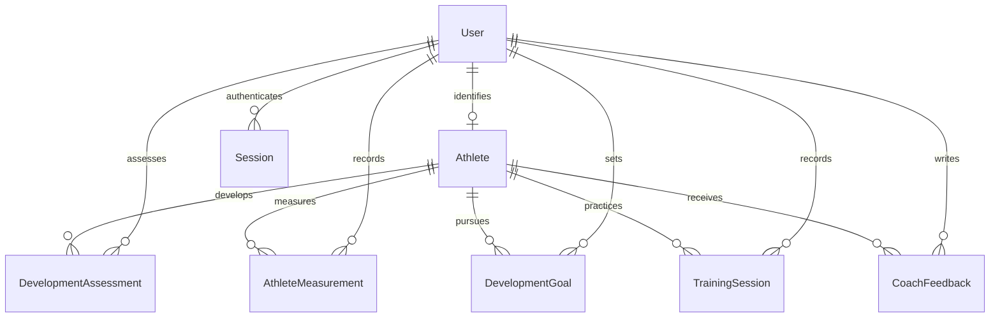

# Domain model

## Entities

| Concept               | Data and relationships                                                                                                                                                            |
| --------------------- | --------------------------------------------------------------------------------------------------------------------------------------------------------------------------------- |
| User                  | UUID, fictional email/name, Coach or Athlete role, optional password hash and optional unique external auth subject. Identity is separate from the athlete profile.               |
| Athlete               | UUID, optional unique User link, fictional name, U9/U12/U15 group, jersey, playing position, current focus, created/updated timestamps. One user may link to at most one athlete. |
| DevelopmentAssessment | Athlete, assessor User, assessment date, seven integer 1–5 ratings, notes and creation timestamp.                                                                                 |
| AthleteMeasurement    | Athlete, recording User, metric enum, numeric value, canonical unit, measured date, protocol and creation timestamp.                                                              |
| DevelopmentGoal       | Athlete, coach, title, description/practice plan, observable target, status, due date, completion timestamp and created/updated timestamps.                                       |
| TrainingSession       | Athlete, coach, session date, session type, duration in minutes, notes and creation timestamp.                                                                                    |
| CoachFeedback         | Athlete, coach, feedback text and creation timestamp. All feedback is visible to its athlete.                                                                                     |
| Session               | Token digest, User and expiry. Lab-only infrastructure.                                                                                                                           |
| LoginThrottle         | Hashed email key, count and window reset. Lab-only infrastructure.                                                                                                                |

## Skill observations

Shooting, Finishing, Ball Handling, Passing, Defense, Rebounding and Athleticism use the same five labels: **Exploring, Developing, Consistent, Confident, Advanced**. Assessors should use comparable drills and interpret observations within the athlete's stage. These are not normalized test scores. The mean of seven observations is shown only as a personal trend; it is not a ranking, selection tool or evidence of talent potential.

## Measurable performance

| Metric                 | Unit | Accepted bounds | Comparison                                   |
| ---------------------- | ---- | --------------- | -------------------------------------------- |
| Free throws            | %    | 0–100           | Higher under comparable attempts/conditions  |
| Shooting / field goal  | %    | 0–100           | Higher under comparable locations/conditions |
| Standing vertical jump | cm   | 0–150           | Higher under comparable method               |
| 20 m sprint            | s    | 1–30            | Lower under comparable timing method         |

Units come from the metric definition on the server. Percentages are stored as 0–100, not 0–1. Fractional measurements are supported. A required protocol describes attempts, test conditions or timing method. Raw attempts, devices, calibrated evidence and structured protocols are not modeled yet; free text must not be treated as official provenance.

## History invariants

- Assessment and measurement dates use PostgreSQL `date` and UTC-only formatting. The lab uses UTC calendar dates consistently; a production academy needs an explicit local-calendar policy.
- Historical observations cannot be edited or deleted through the application. New observations append rows. Updating Athlete changes neither history nor its authorship.
- History sorts by effective date, then creation timestamp and ID. A backdated observation remains in its historical position. Same-day observations are preserved and may share a chart x-coordinate.
- Goals have Not started, In progress and Completed states. All transitions are allowed in this exploratory lab. A completed date is required exactly when completed. Intermediate status transitions are not journaled.
- Training types are Skill work, Team practice, Strength & conditioning and Game review; duration is 5–240 minutes.
- Foreign keys restrict domain-parent removal; no deletion UI exists. Database constraints supplement server validation. The current database owner could still amend records directly; this is not a tamper-evident audit system.

## Synthetic fixture design

Four athletes in each age group, two fictional coaches and fictional `.example.test` accounts. Every seeded athlete has four observations over roughly three months, all four measurement series, three goals with mixed statuses, four sessions and two feedback entries. Values are deterministic, plausible practice examples with deliberately simple improving trends. They are not representative basketball benchmarks and cannot validate the rubric's scientific or coaching quality. No birthdays, schools, phone numbers, guardians, medical information or real athlete likenesses are stored.
